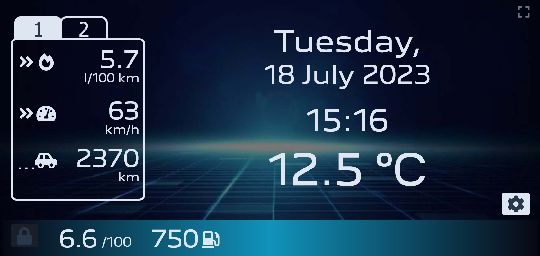
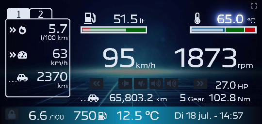

<h3 align="center">PSA (Peugeot, Citroën) VAN bus Live Connect</h3>

Live data from your PSA vehicle (Peugeot, Citroën) on your smartphone or tablet, directly from
the VAN bus.

---

## 📝 Table of Contents

- [Screenshots](#screenshots)
- [Description](#description)
- [Technical Details](#details)
- [Schematics](#schematics)
- [Building the Project](#building)
- [Hints and tips](#hints_tips)
- [Used Libraries](#libraries)
- [Work to be Done](#todo)
- [Frequently Asked Questions](#faq)
- [References](#extref)
- [License](#license)

## 📟 Screenshots

Don't bore us, give us the screenshots!

> 👉 See some exciting live videos and pics at https://drive.google.com/drive/folders/1PScPrWulKUc7Rnl3Ug-_TO_tbdkDwQCP !

**Main entry screen:**

**Tuner:**

**Tuner presets popup:**

**Audio settings:**

**CD player:**

**CD changer:**

**Second trip counter:**

**"Pre-flight" checks:**

**Instrument cluster (YMMV 🤣):**

**Current location:**

**Sat nav main menu:**

**Sat nav enter destination - city:**

**Sat nav - personal address entry (not mine!):**

**Sat nav guidance:**

**Door open popup:**

**Warning popup:**

## 🎈 Description 

This application creates a Wi-Fi access point to which you can connect with your smartphone.
It contains a captive portal so as soon as you are connected a message gets displayed on your phone to log in.
If you tap the message, a browser opens, giving a live visual display of the data as read from the VAN bus.

* The SSID of the Wi-Fi access point is: "PSA display AP" (with the spaces, without the quotes).
* The password is "12345678" (without the quotes).

Of course you can modify the SSID and choose your own password (or have no password at all) by editing
the [`Config.h`](VanLiveConnect/Config.h#L26) file.

## 🕹️ MFD functions supported

See also the [screenshots](#screenshots) above.

* Clock with exterior temperature
* Instruments (speed, RPM, fuel level, engine temperature, lights and indicators)
* "Pre-flight" checks (oil and fuel level, engine temperature)
* Odometer and trip counters
* Live fuel data (consumption, remaining distance)
* Radio (tuner)
* Cassette tape player (well... even CD is vintage these days 😉)
* Head unit internal CD player
* CD changer unit
* Notifications and warnings
* Satellite Navigation (maps are out of date but it's a nice gimmick 😇)
* Multiple languages: English, French, German, Spanish, Italian and Dutch
* Setting color theme and brightness
* Setting format and units

> 👉 Note: availability will depend on your vehicle's configuration.

Will not support:
* Setting date and time: your smartphone already knows...

## ⚙️ Technical Details

In the beginning of 2000's the PSA group (Peugeot and Citroën) used ["VAN" bus] as a communication protocol
between the various comfort-related equipment. Later, around 2005, they started to replace this protocol
in their newer cars with the CAN bus protocol, however some models had VAN bus inside them until 2009.
[This overview](https://github.com/morcibacsi/PSAVanCanBridge#compatibility) lists vehicles that are
supposedly fitted with a VAN (comfort) bus.

The application will tap in on the vehicle's VAN bus and visualize the captured data in a browser on your
smartphone, tablet, laptop or any other device that runs a web browser. The application will run on any
ESP8266 / ESP8285 based board, e.g. [Wemos/Lolin D1 mini](https://www.wemos.cc/en/latest/d1/d1_mini.html)
is supported.

The application will host a HTML web page on standard port 80. It will also host a WebSocket server on
standard port 81. The served web page comes with some JavaScript that connects to this WebSocket server
in order to stream the live data to be visualized.

The web page itself, as served by this sketch, uses and self-hosts the following open-source bundles:
* jQuery v3.5.1 - compressed, production version - original download
  [here](https://code.jquery.com/jquery-3.5.1.min.js).
* FontAwesome v5.15.2 - original download
  [here](https://use.fontawesome.com/releases/v5.15.2/fontawesome-free-5.15.2-web.zip).

As said, the served web page self-hosts all resources. No Internet connection is needed!

## 🔌 Schematics 

You can usually find the VAN bus on pins 2 and 3 of ISO block "A" of your head unit (car radio). See
https://en.wikipedia.org/wiki/Connectors_for_car_audio and https://github.com/morcibacsi/esp32_rmt_van_rx#schematics .

There are various possibilities to hook up a ESP8266 based board to your vehicle's VAN bus:

1. Use a [MCP2551] transceiver, connected with its CANH and CANL pins to the vehicle's VAN bus.
   As the MCP2551 has 5V logic, a 5V ↔ 3.3V [level converter] is needed to connect the CRX / RXD / R pin of the
   transceiver, via the level converter, to a GPIO pin of your ESP8266 board.

   A board with the MCP2551 transceiver can be ordered e.g.
   [here](https://domoticx.net/webshop/can-bus-transceiver-module-5v-mcp2551/) or
   [here](https://nl.aliexpress.com/item/1005003450161614.html).

   Two variants are possible:

    * Using +12 Volt switched line (pin 4 of the "A" block of the ISO connector):
      
    * Using +12 Volt permanent line (pin 7 of the "A" block of the ISO connector). To prevent battery drain,
      the ESP board will go to sleep after 5 minutes ([configurable in `Config.h`](VanLiveConnect/Config.h#L82)).
      This setup requires [GPIO line D1](VanLiveConnect/Config.h#L118) to be connected, so that the ESP board
      wakes up as soon as any activity occurs on the VAN bus.
      

> 👉 Notes:
>  * The two terminator
     resistors R3 and R4 (2 x 100 Ohm, near the CANH and CANL pins) on this transceiver board
     are meant for operating inside a CAN bus network, but are not necessary on a VAN bus. In fact, they may even
     cause the other equipment on the bus to malfunction. If you experience problems in the vehicle equipment,
     you may want to remove (unsolder) these terminator resistors.
     See also [this issue](https://github.com/0xCAFEDECAF/VanBus/issues/9).
>  * CANH of the transceiver is connected to VAN BAR (DATA B), CANL to VAN (DATA). This may seem illogical
     but in practice it turns out this works best.
>  * The clamping circuit (D1, D2, R1) seems to (somehow) help in reducing the amount of bit errors
     (packet CRC errors).

2. Use a [SN65HVD230] transceiver, connected with its CANH and CANL pins to the vehicle's VAN bus.
   The SN65HVD230 transceiver already has 3.3V logic, so it is possible to directly connect the CRX / RXD / R pin of
   the transceiver to a GPIO pin of your ESP8266 board.

   A board with the SN65HVD230 transceiver can be ordered e.g.
   [here](https://domoticx.net/webshop/can-bus-transceiver-module-3-3v-sn65hvd230-vp230/) or
   [here](https://eu.robotshop.com/products/waveshare-can-board-sn65hvd230).

   

   The "+12 Volt permanent" variant as described above is possible for this setup too.

> 👉 Notes:
>  * The terminator
     resistor R2 (120 Ohm, near the CANH and CANL pins) on this transceiver board is meant
     for operating inside a CAN bus network, but is not necessary on a VAN bus. In fact, it may even cause the
     other equipment on the bus to malfunction. If you experience problems in the vehicle equipment, you may
     want to remove (unsolder) the R2 terminator resistor.
     See also [this issue](https://github.com/0xCAFEDECAF/VanBus/issues/9).
>  * CANH of the transceiver is connected to VAN BAR (DATA B), CANL to VAN (DATA). This may seem illogical
     but in practice it turns out this works best.
>  * The clamping circuit (D1, D2, R1) seems to (somehow) help in reducing the amount of bit errors
     (packet CRC errors).

3. The simplest schematic is not to use a transceiver at all, but connect the VAN DATA line to GrouND using
   two 4.7 kOhm resistors. Connect the GPIO pin of your ESP8266 board to the 1:2 [voltage divider] that is thus
   formed by the two resistors. Results may vary.

> 👉 Note: I used this schematic during many long debugging hours, but I cannot guarantee that it won't ultimately
     cause your car to explode! (or anything less catastrophic)

### Infra-red control

When the IR remote control is used to navigate, e.g. through the sat nav menus, this is usually not reflected on the
comfort bus. So, reading the VAN comfort bus is not enough to detect e.g. scrolling through the menus or lists
presented.

To see the navigation through the menus and lists also on the browser screen, simply connect an infra-red
receiver, e.g. like [this one](https://www.tinytronics.nl/shop/en/communication/infrared/hx1838-ir-receiver-38khz),
on pins D5, D6 and D7, facing outward; see also the above schematics.

> 👉 Notes:
>  * Don't remove or unsolder the infra-red receiver (PCB) from the original MFD type C display. The original
     MFD needs that to receive the commands you send to it, in order to generate the correct VAN bus packets.
>  * The infra-red receiver is not needed to switch screens. If you turn on the head unit (radio, CD player, ...)
     the screen will automatically switch to it. You can also switch screens on your smartphone or tablet simply
     by tapping the center of the screen. The smartphone or tablet will cycle only through the applicable screens,
     i.e., if the head unit is not powered on, the head unit screen will be skipped.

## 🚀 Building the Project

Before proceeding with this project, make sure you check all the following prerequisites.

#### 1. Install Arduino IDE

See [Arduino IDE](https://www.arduino.cc/en/software). I am currently using
[version 1.8.19](https://downloads.arduino.cc/arduino-1.8.19-windows.exe) but other versions
may also be working fine.

#### 2. Install ESP8266 Board in Arduino IDE

We’ll program the ESP8266 using Arduino IDE, so you must have the ESP8266 add-on installed. You will need:

* [Arduino IDE](https://www.arduino.cc/en/software), with
* [ESP8266 Board Package](https://arduino-esp8266.readthedocs.io/en/stable/installing.html) installed.
  I am currently using [version 3.1.2](https://github.com/esp8266/Arduino/releases/tag/3.1.2) but other versions
  seem to be also working fine (I tested with versions 2.6.3 ... 3.1.2).

Follow the next tutorial to install the IDE and the ESP8266 Board Package:

* [Install ESP8266 Board in Arduino IDE (Windows, Mac OS X, Linux)](https://randomnerdtutorials.com/how-to-install-esp8266-board-arduino-ide/)

#### 3. Install Libraries

In the Arduino IDE, go to the "Sketch" menu → "Include Library" → "Manage Libraries...". Make sure to install:

* [Arduino Library for the ESP8266 VAN Bus](https://github.com/0xCAFEDECAF/VanBus) - Tested with versions
  0.2.4 and higher. Best to use [latest](https://github.com/0xCAFEDECAF/VanBus/archive/refs/heads/master.zip).
* [ESPAsyncTCP library by me-no-dev, fork by dvarrel](https://github.com/dvarrel/ESPAsyncTCP) - Tested with
  version 1.2.4 .
* [ESPAsyncWebSrv library by me-no-dev, fork by dvarrel](https://github.com/dvarrel/ESPAsyncWebSrv) - Tested with
  version 1.2.6, 1.2.7 and 1.2.9 . Skip version 1.2.8: it does not compile on the ESP8266.

For more explanation on using the Arduino library manager, you can browse to:
* this [tutorial from Arduino](https://docs.arduino.cc/software/ide-v1/tutorials/installing-libraries), and
* this [explanation from Adafruit](https://learn.adafruit.com/adafruit-all-about-arduino-libraries-install-use/library-manager)

> 👉 Note: for best performance and stability, make sure to copy all the patched files inside and under the
[VanLiveConnect/Patches/ directory](https://github.com/0xCAFEDECAF/VanLiveConnect/tree/main/VanLiveConnect/Patches) to
the indicated directories in your system. In my experience, these patched files significantly improve the stability
of the WebSocket (TCP/IP over Wi-Fi) communication.

#### 4. Board Settings

I tested with board "LOLIN(WEMOS) D1 R2 & mini". Other ESP8266-based boards may also work.

In the Arduino IDE, go to the "Tools" menu, and choose:

* CPU frequency: "160 MHz"
* Flash size: "4MB (FS:1MB OTA:~1019KB)"
* lwIP variant: "v2 Higher Bandwidth (no features)"
* SSL support: "Basic SSL ciphers (lower ROM use)"

Here is a picture of board settings that have been tested to work:

I seem to have better Wi-Fi performance by setting the variable `build.sdk` to:

    build.sdk=NONOSDK22x_191122

inside the following file:

    %LOCALAPPDATA%\Arduino15\packages\esp8266\hardware\esp8266\3.1.2\platform.txt (Windows)
    $HOME/.arduino15/packages/esp8266/hardware/esp8266/3.1.2/platform.txt (Linux)

#### 5. Compiling

Download https://github.com/0xCAFEDECAF/VanLiveConnect/archive/refs/heads/main.zip and unzip it. Navigate into its
sub-folder `VanLiveConnect` and double-click the `ESP8266_IDE.bat` file (Windows) or `ESP8266_IDE.sh`
file (Linux). This will open the Arduino IDE with all the correct board settings.

> 👉 Note: the `ESP8266_IDE.*` scripts assume that the Arduino IDE was installed in `C:\Program Files (x86)\Arduino`
(Windows) or `/usr/local/bin` (Linux). If you installed the Arduino IDE in a different location, you will need to
update the [`ArduinoIdeEnv.bat`](extras/Scripts/ArduinoIdeEnv.bat#L16) file (Windows) resp. the
[`ArduinoIdeEnv.sh`](extras/Scripts/ArduinoIdeEnv.sh#L16) file (Linux).

#### 6. Uploading

To upload the compiled project you will need the following:

* [COM port driver](https://www.wemos.cc/en/latest/ch340_driver.html) for uploading via the serial port over USB.

First time upload is always via the serial port over USB. After that, the "Over The Air" (OTA) update function
will allow uploading via Wi-Fi using a "network port" in the Arduino IDE. See
[this documentation](https://arduino-esp8266.readthedocs.io/en/latest/ota_updates/readme.html) for help on using the
OTA feature of the arduino-esp8266.

If you have no experience in compiling and uploading, have a look at this excellent
[tutorial for the Wemos D1 mini board](https://www.youtube.com/watch?v=WnRk8w7SyTo)

#### 7. First Run

When the compiled sketch is started for the first time on fresh hardware, it will take a few seconds to initialize
the flash-based file system. In my experience, a sketch binary uploaded to fresh hardware sometimes causes the board to
crash the very first time, but after that it works (uploads) fine.

## 💡 Hints, tips

### Android Connected to Both Wi-Fi and Mobile Data Simultaneously

Ideally, we would like all the Android apps to be able to connect to the Internet via mobile data, while at the
same time the Android client device is showing the vehicle data as coming in via the (non-Internet) "PSA display AP"
Wi-Fi connection

However, Android does not like a Wi-Fi connection that does not have an Internet connection. By default, it will
not use it.

We would like to convince Android that it can use the Wi-Fi connection for the "PSA display AP", and the mobile
data connection for access to the Internet. To achieve that, we need to do a couple of things:

#### Setup

**Step 1.**

When connecting to the Wi-Fi access point as offered by the ESP, your android device will present a system notification
"PSA display AP has no Internet connection. Tap for options.", similar to this:

When tapping, a popup like this appears:

Make sure to check-mark "Don't ask again for this network", then tap "Yes".

The Wi-Fi icon at the top is now shown, but it has a small "X" in it. This small "X" indicates that the
Wi-Fi connection does not offer an Internet connection. Even though, the landing page 'http://<...>/MFD.html'
of the ESP can be accessed successfully.

Even though the Android device is now using Wi-Fi for its "Internet access", it still sees that the
connection is pretty limited. Android tries to access all kinds of other Internet addresses, which (obviously)
fails. Therefore, the Android device now presents a different system notification: "PSA display AP has limited
connectivity. Tap to connect anyway.":

**Step 2.**

When this "limited connectivity" notification appears, make sure to check-mark "Don't ask again for this network",
then tap "Yes":

The Wi-Fi icon at the top is now shown without the small "X" in it. The landing page of the ESP can now be accessed
via Wi-Fi, even with mobile data enabled.

However, it now becomes impossible for the Android device to access the Internet. All network access is routed
towards the Wi-Fi connection, which does not offer Internet. While this is good for accessing the "PSA display AP",
this prevents any apps from accessing the Internet.

**Step 3.**

To make it possible for the Android device to access the Internet while connected to the "PSA display AP", go to
"Settings > Network & internet > Wi-Fi > Wi-Fi preferences > Advanced" and turn on "Switch to mobile data
automatically":

#### Technical details

To make it possible to use the Wi-Fi connection for the "PSA display AP", and the mobile data connection for
access to the Internet, the web server ("WebServer.ino") in the ESP offers a special feature:
[it will respond to any request for '.../generate_204'](https://github.com/0xCAFEDECAF/VanLiveConnect/blob/07993f7bd99c61f70cf326d0882f82bfa13e7644/VanLiveConnect/WebServer.ino#L267).
This makes make Android believe that the Wi-Fi connection has an Internet connection, and therefore it chooses
Wi-Fi as the preferred medium.

Unfortunately, the effect is that now all apps will try to use the (non-Internet) Wi-Fi connection, so all apps will
fail to access the Internet.

The solution is to have the web server in the ESP [stop responding](https://github.com/0xCAFEDECAF/VanLiveConnect/blob/07993f7bd99c61f70cf326d0882f82bfa13e7644/VanLiveConnect/WebServer.ino#L256)
to requests for '.../generate_204' as soon as a data (WebSocket) connection between the ESP and the Android device
is well established.

In this way, the following sequence of events takes place:

1. As soon as the ESP powers up (or wakes up from sleep), it starts to offer its "PSA display AP" Wi-Fi access point.
2. The Android device connects to the Wi-Fi access point. The Wi-Fi icon at the top is now shown without the
   small "X" in it (because the ESP is responding to the '.../generate_204' requests).
3. The landing page 'http://<...>/MFD.html' of the ESP can be accessed by the browser on the Android device, using
   Wi-Fi to connect.
4. The JavaScript code in the landing page sets up a WebSocket connection: vehicle data is sent to the Android
   device and displayed in its browser.
5. About [7 seconds](https://github.com/0xCAFEDECAF/VanLiveConnect/blob/07993f7bd99c61f70cf326d0882f82bfa13e7644/VanLiveConnect/WebServer.ino#L245)
   after the WebSocket connection is established, the web server on the ESP stops responding to the
   '.../generate_204' requests.
6. After a few retries, Android now thinks that the Wi-Fi access point is no longer offering Internet connectivity.
   As a result, it switches to its mobile connection. However, <i>the WebSocket (TCP/IP) connection remains
   established!</i>
7. The apps on the Android device can now access the Internet via the mobile connection, while the vehicle data
   is coming in on the just established WebSocket (TCP/IP) connection.

More background information and explanation can be found
[here](https://www.reddit.com/r/HomeNetworking/comments/r0sruo/android_ignores_routing_table_uses_phone_data/) and
[here](https://superuser.com/questions/701956/android-devices-dont-know-route-to-a-host-located-in-the-same-network).

### OpenVPN

If you are using [OpenVPN for Android](https://f-droid.org/en/packages/de.blinkt.openvpn/) in "Always-on VPN" mode,
you will need to add a route to the local network. Without this route, your smartphone or tablet device will not be
able to find the ESP device after it connects to the ESP's Wi-Fi access point.

To add the route:
* Open the "OpenVPN for Android" app
* Tap the 'pen' icon next to your connection profile
* Tap the 'ADVANCED' tab
  - Make sure 'Persistent tun' is *not* checked
* Tap the 'ROUTING' tab
  - Make sure that 'Bypass VPN for local networks' is selected
* In that same tab, under the 'IPv4' section:
  - Make sure that 'Use default route' is *not* selected
  - Tap 'Excluded Networks'
  - Enter `192.168.4.0/24` (note: the `"192.168.4."` part must match with the IP address as specified in
    [`Config.h`](VanLiveConnect/Config.h#L32)).
  - Tap 'OK'

The 'ROUTING' tab will look like this:

After setting the above, press the Android 'Back' button to go back to the overview of connection profile.

### Automating your smartphone or tablet

It is possible (and very convenient!) to automate all actions that are needed to start displaying your
vehicle information on your smartphone or tablet as soon as you enter the vehicle. An excellent app that offers all
necessary functions is [MacroDroid - Device Automation]

Below are screenshots that show two macros which perform all the necessary actions:

||  |
|---|---|
|||

#### "VanLiveConnect" macro

Upon connection to the Wi-Fi SSID "PSA display AP", performs the following actions:
* Set the screen timeout value to 500 minutes, to prevent the screen from going black while driving
* Browse to the main screen (http://192.168.4.1/MFD.html)
* Set the screen brightness to 100%
* Go "full-screen"

#### "VanLiveDisconnect" macro

Upon disconnection from "PSA display AP", performs the following actions:

* Set the screen brightness back to 88%
* Set the screen timeout value back to 2 minutes
* Go back to the system home (launcher) screen

Of course, the above actions are just a suggestion. Customize as you like!

## 📚 Used Libraries

### Arduino/ESP8266

In the Arduino IDE, the following libraries are used:

* [Arduino Library for the ESP8266 VAN Bus](https://github.com/0xCAFEDECAF/VanBus) - Need at least version 0.2.4 .
* [ESPAsyncTCP library by me-no-dev, fork by dvarrel](https://github.com/dvarrel/ESPAsyncTCP) - Tested with
  version 1.2.4 .
* [ESPAsyncWebSrv library by me-no-dev, fork by dvarrel](https://github.com/dvarrel/ESPAsyncWebSrv) - Tested with
  version 1.2.6, 1.2.7 and 1.2.9 . Skip version 1.2.8: it does not compile on the ESP8266.

### Attributions

The application itself embeds:

* Javascript library [jQuery v3.5.1 (compressed, production version)](https://code.jquery.com/jquery-3.5.1.min.js)
  by John Resig is [licensed](https://github.com/jquery/jquery/blob/main/LICENSE.txt) under the
  [MIT License](https://opensource.org/licenses/MIT).

* Font/icons [Font Awesome v5.15.2](https://use.fontawesome.com/releases/v5.15.2/fontawesome-free-5.15.2-web.zip)
  by [Dave Gandy](https://davegandy.github.io/) is [licensed](https://fontawesome.com/license/free) under the following
  licenses:
  - Icons: [CC BY 4.0](https://creativecommons.org/licenses/by/4.0/)
  - Fonts: [SIL OFL 1.1](https://scripts.sil.org/OFL)
  - Code: [MIT](https://opensource.org/licenses/MIT)

* Font/icons [Material Design](https://github.com/Templarian/MaterialDesign)
  by [Austin Andrews](https://github.com/Templarian) is
  [licensed](https://github.com/Templarian/MaterialDesign/blob/master/LICENSE) under the following licenses:
  - Icons: [Apache 2.0](https://www.apache.org/licenses/LICENSE-2.0)
  - Fonts: [Apache 2.0](https://www.apache.org/licenses/LICENSE-2.0)
  - Code: [MIT](https://opensource.org/licenses/MIT)

* Font [Peugeot New](https://www.cdnfonts.com/peugeot-new.font)
  by Emmanuel Benoist for Peugeot Design Lab (http://www.peugeotdesignlab.com) 
  License: unknown

## 👷 Work to be Done

* No plans 😊

## ❓ Frequently Asked Questions

<b>Question:</b> Will this work on my vehicle?

<b>Answer:</b> I have only tested with one vehicle: a 406 from year 2003
[DAM number / Build Code: 9586](http://www.406coupeclub.org/Apps_BuildCodeTranslator.php); see also
[this page](https://web.archive.org/web/20200211061106/http://www.kleinopslag.nl/damnr/) (in Dutch).
My vehicle has a so-called
["type C" Multi-Functional Display (MFD)](https://github.com/0xCAFEDECAF/Peugeot406MfdTypecIrSendArduino#-description).

It will work (at least to some extent) if you have a Peugeot of around 1996-2004, fitted with a VAN comfort bus.

As mentioned, VAN bus was used in the beginning of 2000's by the PSA group (Peugeot and Citroën) as a
communication protocol between the various comfort-related equipment. Later, around 2005, they started to
replace this protocol in their newer cars with the CAN bus protocol.

[This overview](https://github.com/morcibacsi/PSAVanCanBridge#compatibility) lists vehicles that are
supposedly fitted with a VAN (comfort) bus.

---

<b>Question:</b> Do I still need the original multi-functional display (MFD)?

<b>Answer:</b> Yes, you do. But you do not need its (crappy) LCD to be working. The MFD is only needed to generate
the necessary VAN-bus packets to drive the equipment (Tuner, CD-changer, Sat nav, etc.). Maybe in a later stage,
I will be able to reverse-engineer the higher-level protocols and state machines that the MFD implmements. But that
will take time...

---

<b>Question:</b> Which web browsers will this work with?

<b>Answer:</b> I have tested successfully on:
* Windows Desktop
  * Firefox, any recent version
  * Chrome, any recent version
* Mobile
  * Android Firefox 68.11.0 and higher
  * Android Chrome 88.0 and higher

## 📜 References

For background reading:

- [Vehicle Information Service Specification](https://www.w3.org/TR/vehicle-information-service/) - defines
a WebSocket based API for a Vehicle Information Service (VIS) to enable client applications to get, set,
subscribe and unsubscribe to vehicle signals and data attributes.

## 📖 License

This application is open-source and licensed under the [MIT license](http://opensource.org/licenses/MIT).

Do whatever you like with it, but contributions are appreciated!

["VAN" bus]: https://en.wikipedia.org/wiki/Vehicle_Area_Network
[MCP2551]: http://ww1.microchip.com/downloads/en/devicedoc/21667d.pdf
[level converter]: https://www.tinytronics.nl/shop/en/dc-dc-converters/level-converters/i2c-uart-bi-directional-logic-level-converter-5v-3.3v-2-channel-with-supply
[SN65HVD230]: https://www.ti.com/lit/ds/symlink/sn65hvd230.pdf?ts=1592992149874
[voltage divider]: https://www.quora.com/How-many-pins-on-Arduino-Uno-give-a3-3v-pin-output
[MacroDroid - Device Automation]: https://play.google.com/store/apps/details?id=com.arlosoft.macrodroid&hl=en&gl=US
