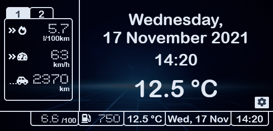
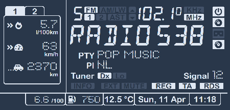
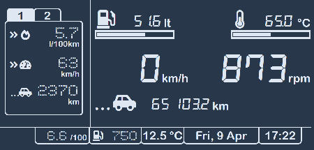

<h3 align="center">PSA VAN bus Live Connect</h3>

---

Live data from your PSA vehicle on your smartphone or tablet, directly from the VAN bus.

## 📝 Table of Contents

- [Screen Shots](#screenshots)
- [Description](#description)
- [Technical Details](#details)
- [Schematics](#schematics)
- [Building the Project](#building)
- [Used Libraries](#libraries)
- [Work to be Done](#todo)
- [Frequently Asked Questions](#faq)
- [License](#license)

## 📟 Screen Shots

Don't bore us, give us the screen shots!

Main entry screen

Tuner

CD player

Second trip counter

"Pre-flight" checks

Instrument cluster

Current location

Sat nav main menu

Sat nav enter destination - city

Sat nav - personal address

Sat nav guidance

## 🎈 Description 

This application creates a Wi-Fi access point to which you can connect with your smart phone.
It contains a captive portal so as soon as you are connected a message gets displayed on your phone to log in.
If you tap the message, a browser opens, giving a live visual display of the data as read from the VAN bus.

* The SSID of the Wi-Fi access point is: "PSA display AP" (with the spaces, without the quotes)
* No password is needed.

Of course you can modify the SSID and choose your own password by editing the ``Config.h`` file.

## ⚙️ Technical Details

In the beginning of 2000's the PSA group (Peugeot and Citroen) used VAN bus as a communication protocol
between the various comfort-related equipment. Later, around 2005, they started to replace this protocol
in their newer cars with the CAN bus protocol, however some models had VAN bus inside them until 2009.

The application will tap in on the vehicle's VAN bus and visualize the captured data in a browser on your
smart phone, tablet, laptop or any other device that runs a web browser. The application will run on any
ESP8266 / ESP8285 based board, e.g. [Wemos/Lolin D1 mini](https://www.wemos.cc/en/latest/d1/d1_mini.html)
is supported.

[ TODO - list a few other devices ]

The application will host a HTML web page on standard port 80. It will also host a websocket server on
standard port 81. The served web page comes with some JavaScript that connects to this websocket server
in order to stream the live data to be visualised.

The web page itself, as served by this sketch, uses and self-hosts the following open-source bundles:
* jQuery v3.5.1 - compressed, production version - original download
  [here](https://code.jquery.com/jquery-3.5.1.min.js).
* FontAwesome v5.15.1 - original download
  [here](https://use.fontawesome.com/releases/v5.15.2/fontawesome-free-5.15.2-web.zip).

As said, the served web page self-hosts all resources. No internet connection is needed!

## 🔌 Schematics 

You can usually find the VAN bus on pins 2 and 3 of ISO block "A" of your head unit (car radio). See 
https://en.wikipedia.org/wiki/Connectors_for_car_audio and https://github.com/morcibacsi/esp32_rmt_van_rx#schematics .

There are various possibilities to hook up a ESP8266 based board to your vehicle's VAN bus:

1. Use a [MCP2551] transceiver, connected with its CANH and CANL pins to the vehicle's VAN bus.
   As the MCP2551 has 5V logic, a 5V ↔️ 3.3V [level converter] is needed to connect the CRX / RXD / R pin of the
   transceiver, via the level converter, to a GPIO pin of your ESP8266 board.

2. Use a [SN65HVD230] transceiver, connected with its CANH and CANL pins to the vehicle's VAN bus.
   The SN65HVD230 transceiver already has 3.3V logic, so it is possible to directly connect the CRX / RXD / R pin of
   the transceiver to a GPIO pin of your ESP8266 board.

   
3. The simplest schematic is not to use a transceiver at all, but connect the VAN DATA line to GrouND using
   two 4.7 kOhm resistors. Connect the GPIO pin of your ESP8266 board to the 1:2 [voltage divider] that is thus
   formed by the two resistors. Results may vary.

   
   👉 Note: I used this schematic during many long debugging hours, but I cannot guarantee that it won't ultimately
      cause your car to explode! (or anything less catastrofic)

When the IR remote control is used to navigate, e.g. through the sat nav menus, this is usually not reflected on the
comfort bus. So, reading the VAN comfort bus is not enough to detect e.g. scrolling through the menus or lists
presented.

To see the navigation through the menus and lists also on the browser screen, simply connect an infra-red
receiver, e.g. like [this one](https://www.tinytronics.nl/shop/en/communication/infrared/hx1838-ir-receiver-38khz),
on pins D5, D6 and D7, facing outward; see also the above schematics.

## 🚀 Building the Project

#### Compiling

To compile the project you will need the following:

* [Arduino IDE](https://www.arduino.cc/en/software), with
* [ESP8266 Board Manager](http://arduino.esp8266.com/Arduino/versions/2.0.0/doc/installing.html) installed, and
* Various libraries installed as listed in the [Used Libraries](#libraries") section below.

In the "Tools" menu, choose:

* CPU frequency: 160 MHz, and
* lwIP variant: "v2 Higher Bandwidth (no features)".

#### Uploading

To upload the compiled project you will need the following:

* [COM port driver](https://www.wemos.cc/en/latest/ch340_driver.html) for uploading via the serial port over USB.

First time upload is always via the serial port over USB. After that, the "Over The Air" (OTA) update function
will allow uploading via Wi-Fi using a "network port" in the Arduino IDE. See
[this documentation](https://arduino-esp8266.readthedocs.io/en/latest/ota_updates/readme.html) for help on using the
OTA feature of the arduino-esp8266.

If you have no experience in compiling and uploading, have a look at this excellent
[tutorial for the Wemos D1 mini board](https://averagemaker.com/2018/03/wemos-d1-mini-setup.html)

## 📚 Used Libraries

### Arduino/ESP8266

In the Arduino IDE, go to the "Sketch" menu → "Include Library" → "Manage Libraries...". Make sure to install:

* [Arduino Library for the ESP8266 VAN Bus](https://github.com/0xCAFEDECAF/VanBus) - Need at least version 0.2.0 .
* [WebSockets Library by Markus Sattler](https://github.com/Links2004/arduinoWebSockets) - Tested with
  version 2.2.0, 2.3.3 and 2.3.4 .

Optionally, for debugging purposes, you can download the following code as ``.zip`` file and install in the Arduino
IDE via the "Sketch" menu → "Include Library" → "Add .ZIP Library...":

* Telnet server for ESP8266 / ESP32 - Cloning the serial port via Telnet - Written by Wolfgang Mattis -
  original download [here](https://github.com/yasheena/telnetspy); the``.zip`` file is found
  [here](https://github.com/yasheena/telnetspy/archive/master.zip).

  This makes it possible to debug via a telnet port instead of having to connect the serial port via USB.
  To switch to the telnet port instead of the physical serial over USB, simply re-define ``#define SERIAL Serial`` to
  ``#define SERIAL TELNETSPY`` in the ``VanLiveConnect.ino`` file.

### Attributions

The application itself embeds:

* Javascript library [jQuery v3.5.1 - compressed, production version](https://code.jquery.com/jquery-3.5.1.min.js)
  by John Resig is [licensed](https://github.com/jquery/jquery/blob/main/LICENSE.txt) under the
  [MIT License](https://opensource.org/licenses/MIT)

* Font/icons [Font Awesome v5.15.1](https://use.fontawesome.com/releases/v5.15.2/fontawesome-free-5.15.2-web.zip)
  by Dave Gandy is [licensed](https://fontawesome.com/license/free) under the following licenses:
  - Icons: [CC BY 4.0 License](https://creativecommons.org/licenses/by/4.0/)
  - Fonts: [SIL OFL 1.1 License](https://scripts.sil.org/OFL)
  - Code: [MIT License](https://opensource.org/licenses/MIT)

* Font [DSEG version 0.46](https://github.com/keshikan/DSEG/releases/download/v0.46/fonts-DSEG_v046.zip)
  by Keshikan(Twitter:@keshinomi_88pro)
  License: Copyright (c) 2018, keshikan (http://www.keshikan.net), with Reserved Font Name "DSEG". This Font
  Software is licensed under the [SIL Open Font License, Version 1.1](https://scripts.sil.org/OFL).

* Font [Dots All For Now JL. 1.00 - 7/16/01](https://fonts2u.com/download/dots-all-for-now-jl.font)
  (c) 2001 by Jeffrey N. Levine.
  License: Freeware for commercial or non-commercial use.

## 👷 Work to be Done

Some menus and screens still need to be completed.

## ❓ Frequently Asked Questions

<b>Question:</b> Will this work on my vehicle?

<b>Answer:</b> I have only tested with one vehicle: a 406 from year 2003
[DAM number / Build Code: 9586](http://www.406coupeclub.org/Apps_BuildCodeTranslator.php); see also
[this page](http://www.kleinopslag.nl/damnr/) (in Dutch).

It will work (at least to some extent) if you have a Peugeot of around 1996-2004, fitted with a VAN comfort bus.

As mentioned, VAN bus was used in the beginning of 2000's by the PSA group (Peugeot and Citroen) as a
communication protocol between the various comfort-related equipment. Later, around 2005, they started to
replace this protocol in their newer cars with the CAN bus protocol.

## 📖 License 

This application is open-source and licensed under the [MIT license](http://opensource.org/licenses/MIT).

Do whatever you like with it, but contributions are appreciated!

[MCP2551]: http://ww1.microchip.com/downloads/en/devicedoc/21667d.pdf
[level converter]: https://www.tinytronics.nl/shop/en/dc-dc-converters/level-converters/i2c-uart-bi-directional-logic-level-converter-5v-3.3v-2-channel-with-supply
[SN65HVD230]: https://www.ti.com/lit/ds/symlink/sn65hvd230.pdf?ts=1592992149874
[voltage divider]: https://www.quora.com/How-many-pins-on-Arduino-Uno-give-a3-3v-pin-output
