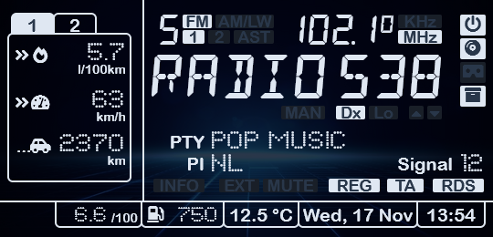
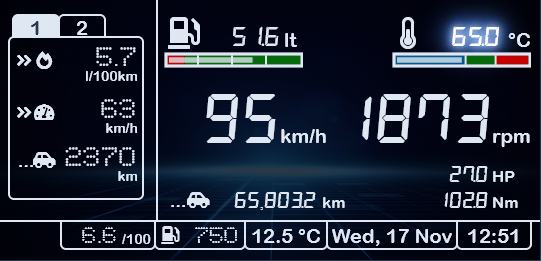

<h3 align="center">PSA (Peugeot, Citroën) VAN bus Live Connect</h3>

---

Live data from your PSA vehicle (Peugeot, Citroën) on your smartphone or tablet, directly from
the VAN bus.

## 📝 Table of Contents

- [Screen Shots](#screenshots)
- [Description](#description)
- [Technical Details](#details)
- [Schematics](#schematics)
- [Building the Project](#building)
- [Hints and tips](#hints_tips)
- [Used Libraries](#libraries)
- [Limitations, Caveats](#limits)
- [Work to be Done](#todo)
- [Frequently Asked Questions](#faq)
- [References](#extref)
- [License](#license)

## 📟 Screen Shots

Don't bore us, give us the screenshots!

**Main entry screen:**

**Tuner:**

**Tuner presets popup:**

**Audio settings:**

**CD player:**

**CD changer:**

**Second trip counter:**

**"Pre-flight" checks:**

**Instrument cluster (YMMV 🤣):**

**Current location:**

**Sat nav main menu:**

**Sat nav enter destination - city:**

**Sat nav - personal address entry (not mine!):**

**Sat nav guidance:**

**Door open popup:**

**Warning popup:**

## 🎈 Description 

This application creates a Wi-Fi access point to which you can connect with your smart phone.
It contains a captive portal so as soon as you are connected a message gets displayed on your phone to log in.
If you tap the message, a browser opens, giving a live visual display of the data as read from the VAN bus.

* The SSID of the Wi-Fi access point is: "PSA display AP" (with the spaces, without the quotes)
* No password is needed.

Of course you can modify the SSID and choose your own password by editing the [``Config.h``](VanLiveConnect/Config.h)
file.

## 🕹️ MFD functions supported

See also the [screenshots](#screenshots) above.

* Clock with exterior temperature
* Instruments (speed, RPM, fuel level, engine temperature)
* "Pre-flight" checks (oil and fuel level, engine temperature)
* Odometer and trip counters
* Live fuel data (consumption, remaining distance)
* Radio (tuner)
* Cassette tape player (well... even CD is vintage these days 😉)
* Head unit internal CD player
* CD changer unit
* Notifications and warnings
* Satellite Navigation (maps are out of date but it's a nice gimmick 😇)
* Multiple languages: English, French, German, Spanish, Italian and Dutch
* Setting color theme and brightness
* Setting format and units

> 👉 Note: availability will depend on your vehicle's configuration.

Will not support:
* Setting date and time: your smartphone already knows...

## ⚙️ Technical Details

In the beginning of 2000's the PSA group (Peugeot and Citroën) used VAN bus as a communication protocol
between the various comfort-related equipment. Later, around 2005, they started to replace this protocol
in their newer cars with the CAN bus protocol, however some models had VAN bus inside them until 2009.

The application will tap in on the vehicle's VAN bus and visualize the captured data in a browser on your
smart phone, tablet, laptop or any other device that runs a web browser. The application will run on any
ESP8266 / ESP8285 based board, e.g. [Wemos/Lolin D1 mini](https://www.wemos.cc/en/latest/d1/d1_mini.html)
is supported.

The application will host a HTML web page on standard port 80. It will also host a websocket server on
standard port 81. The served web page comes with some JavaScript that connects to this websocket server
in order to stream the live data to be visualised.

The web page itself, as served by this sketch, uses and self-hosts the following open-source bundles:
* jQuery v3.5.1 - compressed, production version - original download
  [here](https://code.jquery.com/jquery-3.5.1.min.js).
* FontAwesome v5.15.2 - original download
  [here](https://use.fontawesome.com/releases/v5.15.2/fontawesome-free-5.15.2-web.zip).

As said, the served web page self-hosts all resources. No internet connection is needed!

## 🔌 Schematics 

You can usually find the VAN bus on pins 2 and 3 of ISO block "A" of your head unit (car radio). See 
https://en.wikipedia.org/wiki/Connectors_for_car_audio and https://github.com/morcibacsi/esp32_rmt_van_rx#schematics .

There are various possibilities to hook up a ESP8266 based board to your vehicle's VAN bus:

1. Use a [MCP2551] transceiver, connected with its CANH and CANL pins to the vehicle's VAN bus.
   As the MCP2551 has 5V logic, a 5V ↔️ 3.3V [level converter] is needed to connect the CRX / RXD / R pin of the
   transceiver, via the level converter, to a GPIO pin of your ESP8266 board.

> 👉 Note: CANH of the transceiver is connected to VAN BAR, CANL to VAN. This may seem illogical but in practice
    it turns out this works best.

2. Use a [SN65HVD230] transceiver, connected with its CANH and CANL pins to the vehicle's VAN bus.
   The SN65HVD230 transceiver already has 3.3V logic, so it is possible to directly connect the CRX / RXD / R pin of
   the transceiver to a GPIO pin of your ESP8266 board.

> 👉 Note: CANH of the transceiver is connected to VAN BAR, CANL to VAN. This may seem illogical but in practice
    it turns out this works best.
   
3. The simplest schematic is not to use a transceiver at all, but connect the VAN DATA line to GrouND using
   two 4.7 kOhm resistors. Connect the GPIO pin of your ESP8266 board to the 1:2 [voltage divider] that is thus
   formed by the two resistors. Results may vary.

   
> 👉 Note: I used this schematic during many long debugging hours, but I cannot guarantee that it won't ultimately
    cause your car to explode! (or anything less catastrofic)

When the IR remote control is used to navigate, e.g. through the sat nav menus, this is usually not reflected on the
comfort bus. So, reading the VAN comfort bus is not enough to detect e.g. scrolling through the menus or lists
presented.

To see the navigation through the menus and lists also on the browser screen, simply connect an infra-red
receiver, e.g. like [this one](https://www.tinytronics.nl/shop/en/communication/infrared/hx1838-ir-receiver-38khz),
on pins D5, D6 and D7, facing outward; see also the above schematics.

## 🚀 Building the Project

Before proceeding with this project, make sure you check all the following prerequisites.

#### 1. Install ESP8266 Board in Arduino IDE

We’ll program the ESP8266 using Arduino IDE, so you must have the ESP8266 add-on installed. You will need:

* [Arduino IDE](https://www.arduino.cc/en/software), with
* [ESP8266 Board Manager](http://arduino.esp8266.com/Arduino/versions/2.0.0/doc/installing.html) installed.
  I am currently using [version 2.6.3](https://github.com/esp8266/Arduino/releases/tag/2.6.3) but other versions
  may also be working fine.

Follow the next tutorial to install the IDE and the ESP8266 Board Manager:

* [Install ESP8266 Board in Arduino IDE (Windows, Mac OS X, Linux)](https://randomnerdtutorials.com/how-to-install-esp8266-board-arduino-ide/)

#### 2. Installing Libraries

In the Arduino IDE, go to the "Sketch" menu → "Include Library" → "Manage Libraries...". Make sure to install:

* [Arduino Library for the ESP8266 VAN Bus](https://github.com/0xCAFEDECAF/VanBus) - Need at least version 0.2.5 .
  Should that not work, you can always try [latest](https://github.com/0xCAFEDECAF/VanBus/archive/refs/heads/master.zip).
* [WebSockets Library by Markus Sattler](https://github.com/Links2004/arduinoWebSockets) - Tested with
  version 2.2.0, 2.3.3, 2.3.4 and 2.3.5 .

#### 3. Board settings

In the Arduino IDE, go to the "Tools" menu, and choose:

* CPU frequency: 160 MHz, and
* lwIP variant: "v2 Higher Bandwidth (no features)".

Here is a picture of board settings that have been tested to work:

I seem to have better Wi-Fi performance by setting the variable `build.sdk` to:

    build.sdk=NONOSDK22x_191122

inside the following file:

    %LOCALAPPDATA%\Arduino15\packages\esp8266\hardware\esp8266\2.6.3\platform.txt

#### 4. Uploading

To upload the compiled project you will need the following:

* [COM port driver](https://www.wemos.cc/en/latest/ch340_driver.html) for uploading via the serial port over USB.

First time upload is always via the serial port over USB. After that, the "Over The Air" (OTA) update function
will allow uploading via Wi-Fi using a "network port" in the Arduino IDE. See
[this documentation](https://arduino-esp8266.readthedocs.io/en/latest/ota_updates/readme.html) for help on using the
OTA feature of the arduino-esp8266.

If you have no experience in compiling and uploading, have a look at this excellent
[tutorial for the Wemos D1 mini board](https://averagemaker.com/2018/03/wemos-d1-mini-setup.html)

#### 5. First Run

When the compiled sketch is started for the first time on fresh hardware, it will take a few seconds to initialize
the flash-based file system. In my experience, a sketch binary uploaded to fresh hardware always causes the board to
crash the very first time, but after that it works (uploads) fine.

## 💡 Hints, tips

### Automating your smart phone or tablet

It is possible (and very convenient!) to automate all actions that are needed to start displaying your
vehicle information on your smart phone or tablet as soon as you enter the vehicle. An excellent app that offers all
necessary functions is [MacroDroid - Device Automation]

Below are screenshots that show two macros which perform all the necessary actions:

  

#### "VanLiveConnect" macro

Upon connection to the Wi-Fi SSID "PSA display AP", performs the following actions:
* Set the screen timeout value to 500 minutes, to prevent the screen from going black while driving
* Force the screen rotation to "landscape"
* Browse to the main screen
* Go "full-screen"
* Set the screen brightness to 100%

#### "VanLiveDisconnect" macro

Upon disconnection from "PSA display AP", performs the following actions:

* Set the screen brightness back to 80%
* Set the screen timeout value back to 2 minutes
* Remove the forced screen rotation
* Go back to the system home (launcher) screen

Of course, the above actions are just a suggestion. Customize as you like!

## 📚 Used Libraries

### Arduino/ESP8266

In the Arduino IDE, the following libraries are used:

* [Arduino Library for the ESP8266 VAN Bus](https://github.com/0xCAFEDECAF/VanBus) - Need at least version 0.2.2 .
* [WebSockets Library by Markus Sattler](https://github.com/Links2004/arduinoWebSockets) - Tested with
  version 2.2.0, 2.3.3, 2.3.4 and 2.3.5 .

### Attributions

The application itself embeds:

* Javascript library [jQuery v3.5.1 (compressed, production version)](https://code.jquery.com/jquery-3.5.1.min.js)
  by John Resig is [licensed](https://github.com/jquery/jquery/blob/main/LICENSE.txt) under the
  [MIT License](https://opensource.org/licenses/MIT)

* Font/icons [Font Awesome v5.15.2](https://use.fontawesome.com/releases/v5.15.2/fontawesome-free-5.15.2-web.zip)
  by Dave Gandy is [licensed](https://fontawesome.com/license/free) under the following licenses:
  - Icons: [CC BY 4.0 License](https://creativecommons.org/licenses/by/4.0/)
  - Fonts: [SIL OFL 1.1 License](https://scripts.sil.org/OFL)
  - Code: [MIT License](https://opensource.org/licenses/MIT)

* Font [DSEG version 0.46](https://github.com/keshikan/DSEG/releases/download/v0.46/fonts-DSEG_v046.zip)
  by Keshikan (Twitter:@keshinomi_88pro). 
  License: Copyright (c) 2018, keshikan (http://www.keshikan.net), with Reserved Font Name "DSEG". 
  This Font Software is licensed under the [SIL Open Font License, Version 1.1](https://scripts.sil.org/OFL).

* Font [Dots All For Now JL. 1.00 - 7/16/01](https://fonts2u.com/download/dots-all-for-now-jl.font)
  (c) 2001 by Jeffrey N. Levine.
  License: Freeware for commercial or non-commercial use.

## ⚠️ Limitations, Caveats

Not all VAN bus packets are received error-free; see [this explanation](https://github.com/0xCAFEDECAF/VanBus#limits).

When using the sat nav, this sometimes causes a screen to stay empty. If that happens, try again by using the "Esc"
button on the remote control and going into the same screen again.

I am investigating how to improve on the error-free reception of VAN bus frames.

## 👷 Work to be Done

* No plans 😊

## ❓ Frequently Asked Questions

<b>Question:</b> Will this work on my vehicle?

<b>Answer:</b> I have only tested with one vehicle: a 406 from year 2003
[DAM number / Build Code: 9586](http://www.406coupeclub.org/Apps_BuildCodeTranslator.php); see also
[this page](http://www.kleinopslag.nl/damnr/) (in Dutch).

It will work (at least to some extent) if you have a Peugeot of around 1996-2004, fitted with a VAN comfort bus.

As mentioned, VAN bus was used in the beginning of 2000's by the PSA group (Peugeot and Citroën) as a
communication protocol between the various comfort-related equipment. Later, around 2005, they started to
replace this protocol in their newer cars with the CAN bus protocol.

---

<b>Question:</b> Do I still need the original multi-functional display (MFD)?

<b>Answer:</b> Yes, you do. But you do not need its (crappy) LCD to be working. The MFD is only needed to generate
the necessary VAN-bus packets to drive the equipment (Tuner, CD-changer, Sat nav, etc.). Maybe in a later stage,
I will be able to reverse-engineer the higher-level protocols and state machines that the MFD implmements. But that
will take time...

---

<b>Question:</b> Which web browsers will this work with?

<b>Answer:</b> I have tested successfully on:
* Windows Desktop
  * Firefox, any recent version
  * Chrome, any recent version
* Mobile
  * Android Firefox 68.11.0 and higher
  * Android Chrome 88.0 and higher

## 📜 References

For background reading:

- [Vehicle Information Service Specification](https://www.w3.org/TR/vehicle-information-service/) - defines
a WebSocket based API for a Vehicle Information Service (VIS) to enable client applications to get, set,
subscribe and unsubscribe to vehicle signals and data attributes.

## 📖 License

This application is open-source and licensed under the [MIT license](http://opensource.org/licenses/MIT).

Do whatever you like with it, but contributions are appreciated!

[MCP2551]: http://ww1.microchip.com/downloads/en/devicedoc/21667d.pdf
[level converter]: https://www.tinytronics.nl/shop/en/dc-dc-converters/level-converters/i2c-uart-bi-directional-logic-level-converter-5v-3.3v-2-channel-with-supply
[SN65HVD230]: https://www.ti.com/lit/ds/symlink/sn65hvd230.pdf?ts=1592992149874
[voltage divider]: https://www.quora.com/How-many-pins-on-Arduino-Uno-give-a3-3v-pin-output
[MacroDroid - Device Automation]: https://play.google.com/store/apps/details?id=com.arlosoft.macrodroid&hl=en&gl=US
